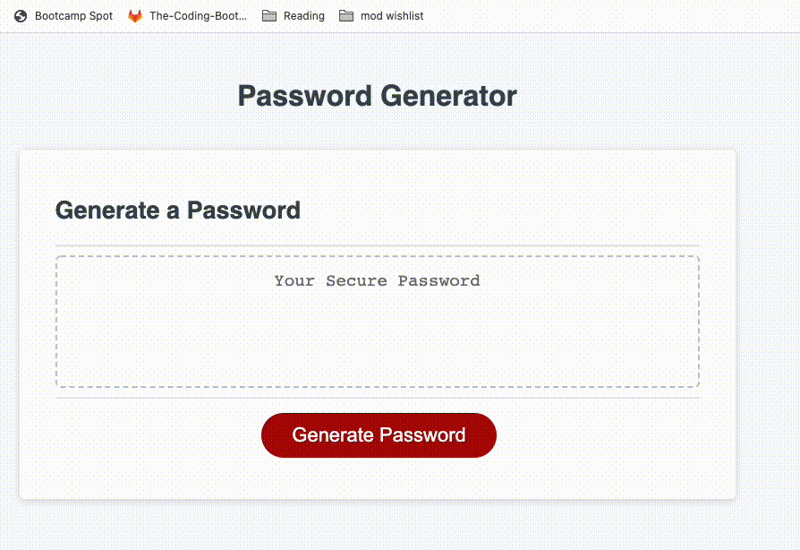

# Password Generator

## Table of Contents
1. [Description](#description)
2. [Visuals](#visuals)
3. [Resources](#resources)

### Description
For this challenge, I built upon starter code to create a password generator. When the button is clicked. the user will be prompted to choose a length of no fewer than 8 characters and no more than 128. After this, they will answer prompts to determine if they would like to include uppercase letters, lower case letters, numbers, and special characters in their password. 
If the user does not meet the required length, or does not select at least one element, they are alerted to the error and asked to begin again. After all prompts are answered, a random password based on the user criteria is answered. 
 
 ## Visuals 
 

 ## Resources 
 * Live Site (https://untjala.github.io/password-generator/)
 * Repository (https://github.com/untjala/password-generator)